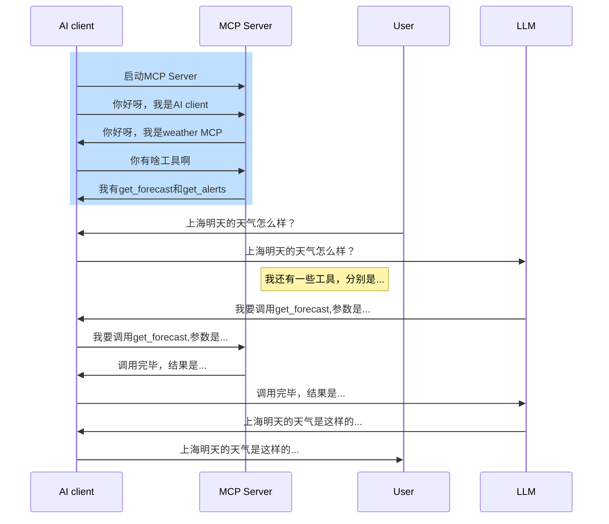

# MCP overview
## 明天上海的天气怎么样？
LLM本身受限于过时的训练数据无法提供精确的答案

能调用外部工具，是大模型进化为智能体Agent的关键，如果不能使用外部工具，大模型就只能是个简单的聊天机器人，甚至连查询天气都做不到。由于底层技术限制，大模型本身是无法和外部工具直接通信的，因此Function calling的思路，就是创建一个外部函数（function）作为中介，一边传递大模型的请求，另一边调用外部工具，最终让大模型能够间接的调用外部工具。

然而，这种集成需要一种结构良好的方法来处理将提示转换为可操作指令以及这些指令的执行。这时，Function calling 函数调用和模型上下文协议 (MCP) 便应运而生，

## System prompt
预设主要用来描述AI的角色、性格、背景知识、语气。可以让LLM根据历史数据来推测天气。
比如豆包里面集成的AI智能体，用户可以预设System prompt来自己创建智能体。


## Tool
可以预先定义查询天气的函数。

```mermaid
%% Get weather sequence diagram
  sequenceDiagram
    get_weather()->>AI client: 注册
    AI client->>AI client: 生成System Prompt(工具使用说明书)
    Note right of AI client: get_weather()可以查询天气,如何想使用就返回我要调用+工具名
    User->>AI client:请问明天上海的天气怎么样？
    AI client->>LLM: User Prompt:请问明天上海的天气怎么样？+ System Prompt
    LLM->>AI client: 我要调用+get_weather()
    AI client->>get_weather(): call get_weather()
    get_weather()-->>AI client: 返回天气结果
    AI client-->>LLM:返回天气结果
    LLM-->>User: 汇总并返回最终天气结果
```

我们把AI client这种负责在模型、工具和最终用户之间传话的程序就叫做AI Agent， 而提供给AI调用的函数或者服务就叫做Agent Tool.

### 缺点
- LLM是概率模型，返回跟AI client的格式有可能不对
- System Prompt需要定义LLM的返回格式

## Funtion callling
统一格式，规范描述，更加有针对性的训练AI模型理解调用场景

```
工具定义：
{
  "name": "get_weather",
  "desc": "查询天气",
  "params": {
    "city": "str"
  }
}

LLM response：
{
  "type": "call",
  "name": "get_weather",
  "params": {
    "city": "str"
  }
}
```
### Funtion call的流程


例如，当我们要查询当前天气时，让大模型调用外部工具的function calling的过程就如图所示：


### Function call的不足
- 工具使用说明书（API Schema）写起来比较复杂，协议碎片化，需要为每个模型单独开发适配层
- 每家大厂的标准不一样，很多开源模型还不支持Function calling
- 功能扩展难，API schema变化，新增工具需要调整接口
- 已有的工具无法复用, 需求：把通用的Tool变成服务统一托管，所有的AI client/Agent都来调用 -> MCP


## MCP
### 官方定义
Model Context Protocol（MCP，模型上下文协议），这是一种 全新的标准，用于将 AI 助手 连接到实际存储数据的 系统，包括 内容存储库、企业工具、开发环境 等。MCP 的目标是帮助 前沿大模型 生成 更优质、更相关的响应。
随着 AI 助手 进入主流应用，整个行业在 模型能力 方面投入了大量资源，推动了 推理能力和质量 的快速发展。然而，即便是最先进的模型 仍受限于 数据孤岛 和 传统系统，无法轻松访问外部数据。每新增一个数据源都需要 单独的自定义集成，这使得 真正互联的 AI 生态 难以规模化扩展。
MCP 解决了这一挑战。它提供了一种 通用、开放的标准，用于将 AI 系统与数据源连接在一起，取代传统的碎片化集成，实现更简洁、高效、稳定的 AI 数据访问方式。

MCP 是一种 开放标准，它允许开发者 安全地 在 数据源 和 AI 工具 之间建立 双向连接。其架构非常简单：
- 开发者可以通过 MCP 服务器 公开他们的数据；
- AI 应用（MCP 客户端） 可以连接到 MCP 服务器，获取所需数据。

### MCP的目标


MCP的目标，就是能在工具或者Agent开发过程中，让大模型更加便捷的调用外部工具。为此，MCP提出了两个方案。
- 其一，“车同轨、书同文”，统一Function calling的运行规范。
首先是先统一名称，MCP把大模型运行环境称作 MCP Client，也就是MCP客户端，同时，把外部函数运行环境称作MCP Server，也就是MCP服务器，


- 然后，统一MCP客户端和服务器的运行规范，并且要求MCP客户端和服务器之间，也统一按照某个既定的提示词模板进行通信。
“车同轨、书同文”最大的好处就在于，可以避免MCP服务器的重复开发，也就是避免外部函数重复编写。例如，像查询天气、网页爬取、查询本地MySQL数据库这种通用的需求，大家有一个人开发了一个服务器就好，开发完大家都能复制到自己的项目里来使用，不用每个人每次都单独写一套。

### 🔹 MCP 的总体架构
MCP 采用 客户端-服务器（Client-Server）架构，其中主机应用可以连接多个 MCP 服务器：


### 📌 MCP 主要组件：
- MCP 主机（Hosts）：如 Claude 桌面应用、IDE、AI 工具，用于通过 MCP 访问数据
- MCP 客户端（Clients）：负责 与 MCP 服务器建立 1:1 连接
- MCP 服务器（Servers）：轻量级程序，通过 标准化的 MCP 协议 提供特定能力
- 本地数据源（Local Data Sources）：你的 计算机文件、数据库和服务，MCP 服务器可以安全访问
- 远程服务（Remote Services）：可通过 API 访问的外部系统，MCP 服务器可以连接这些系统

### 🔹 核心 MCP 概念
MCP 服务器主要提供 三种能力：
1. 资源（Resources）：类似文件的数据，可以被客户端读取（如 API 响应、文件内容、SharePoint、Confluence）。
2. 工具（Tools）：LLM 可以调用的函数（需要用户授权）。
3. 提示词（Prompts）：帮助用户完成特定任务的预定义模板。

📌 主要关注 MCP 的 “工具（Tools）” 机制。

### MCP store
https://mcp.so/


### 传输协议

1. 标准输入/输出（stdio）
stdio 传输支持通过标准输入和输出流进行通信。这对于本地集成和命令行工具尤其有用。

2. 服务器发送事件 (SSE)
SSE 传输通过 HTTP POST 请求实现服务器到客户端的流式传输，从而实现客户端到服务器的通信。


### 消息格式， JSON-RPC 2.0

1. Request
```
{
  jsonrpc: "2.0",
  id: number | string,
  method: string,
  params?: object
}
```

2. Response

```
{
  jsonrpc: "2.0",
  id: number | string,
  result?: object,
  error?: {
    code: number,
    message: string,
    data?: unknown
  }
}
```


### MCP天气服务器
https://github.com/modelcontextprotocol/quickstart-resources/blob/main/weather-server-python/weather.py

📌 导入依赖并初始化服务器
```
from typing import Any
import httpx
from mcp.server.fastmcp import FastMCP

# Initialize FastMCP server
mcp = FastMCP("weather")

# Constants
NWS_API_BASE = "https://api.weather.gov"
USER_AGENT = "weather-app/1.0"
```

🔹 添加辅助函数
接下来，我们编写 辅助函数，用于向 美国国家气象局 API（NWS API） 发送请求，并格式化返回的数据。

```
async def make_nws_request(url: str) -> dict[str, Any] | None:
    """向 NWS API 发送请求，并进行错误处理"""
    headers = {
        "User-Agent": USER_AGENT,
        "Accept": "application/geo+json"
    }
    async with httpx.AsyncClient() as client:
        try:
            response = await client.get(url, headers=headers, timeout=30.0)
            response.raise_for_status()
            return response.json()
        except Exception:
            return None
def format_alert(feature: dict) -> str:
    """将天气警报信息格式化为可读字符串"""
    props = feature["properties"]
    return f"""
事件: {props.get('event', '未知')}
区域: {props.get('areaDesc', '未知')}
严重程度: {props.get('severity', '未知')}
描述: {props.get('description', '无描述')}
说明: {props.get('instruction', '无具体说明')}
"""
```

🔹 实现工具执行逻辑
工具执行处理器负责调用具体的工具逻辑。让我们实现 获取天气警报 和 获取天气预报 的方法。  
1️⃣ 获取天气警报

```
@mcp.tool()
async def get_alerts(state: str) -> str:
    """获取美国某个州的天气警报
    Args:
        state: 美国州的两位字母代码（如 CA、NY）
    """
    url = f"{NWS_API_BASE}/alerts/active/area/{state}"
    data = await make_nws_request(url)
    if not data or "features" not in data:
        return "无法获取天气警报或当前无警报。"
    if not data["features"]:
        return "该州当前无活动警报。"
    alerts = [format_alert(feature) for feature in data["features"]]
    return "\n---\n".join(alerts)
```
2️⃣ 获取天气预报
```
@mcp.tool()
async def get_forecast(latitude: float, longitude: float) -> str:
    """获取某个地理位置的天气预报
    Args:
        latitude: 纬度
        longitude: 经度
    """
    # 获取天气网格的 API 端点
    points_url = f"{NWS_API_BASE}/points/{latitude},{longitude}"
    points_data = await make_nws_request(points_url)
    if not points_data:
        return "无法获取该位置的天气数据。"
    # 获取天气预报 URL
    forecast_url = points_data["properties"]["forecast"]
    forecast_data = await make_nws_request(forecast_url)
    if not forecast_data:
        return "无法获取详细天气预报信息。"
    # 解析并格式化前 5 个时间段的预报
    periods = forecast_data["properties"]["periods"]
    forecasts = []
    for period in periods[:5]:  # 仅显示最近 5 个时间段
        forecast = f"""
{period['name']}:
温度: {period['temperature']}°{period['temperatureUnit']}
风速: {period['windSpeed']} {period['windDirection']}
天气情况: {period['detailedForecast']}
"""
        forecasts.append(forecast)
    return "\n---\n".join(forecasts)
```

🔹 运行服务器
最后，我们需要初始化并运行服务器：

```
if 
name
 == "
__main__
":
    # 运行 MCP 服务器
    mcp.run(transport='stdio')
```

#### MCP Flow




## A2A
A2A（Agent2Agent）是一种开放协议，旨在实现不透明Agent之间的通信和互操作。其主要作用就是为不同的Agent提供一种共同的“语言”标准，在它们需要“交流”的时候可以更加简单、高效与安全，实现信息共享与任务分配，从而更快的完成任务，即使它们的底层平台完全不同.

整体上而言，A2A提供的价值与MCP是类似的：
- 降低异构Agent之间的集成复杂性：你无需了解对端Agent的细节。
- 提高Agent能力的可复用性：你可以把某个任务交给更擅长它的Agent。
- 更好的扩展性以适应变化：Agent的内部逻辑变化可以被A2A所隔离。

A2A协议对Agent之间集成的如下方面进行标准化：
- 集成架构与关键组件
- 消息与通信机制（JSON-RPC2.0与HTTP）
- 服务端与客户端的功能规范
- 安全验证与授权机制

### A2A与MCP什么关系？
A2A在诞生动机、架构甚至协议方面都与MCP非常相似，但它们之间的关系与区别还是很清楚的：
MCP解决的是Agent与外部工具/数据之间的集成，是Agent的“内部事务”；A2A解决的是Agent与Agent之间的集成，属于更高层次的集成关系。
它们之间是可以共存与协作的，比如：


在这样的架构中Agent通过MCP使用工具，Agent与Agent之间则通过A2A产生互动与协作。  

我们对两者做个简单的对比：  


